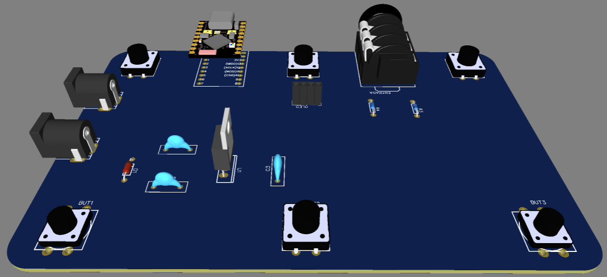

| Supported Targets | ESP32-S3 |
| ----------------- | -------- |

# _Tonex ONE_

This project is completely based on the project, only the implementation of the 20x4 LCD display using I2C and the footswitch functions were done.

https://github.com/Builty/TonexOneController/tree/main

## Build
The project is ready to be built using the ESP32-S3 SUPER-MINI. To modify the platform, simply adjust the pinout in the folder.

## ESP32-S3

## Circuit Schematics

## 3d Circuit

Gerber: (Files/Gerber_TONEX.zip)

## Case 3d

## Device

