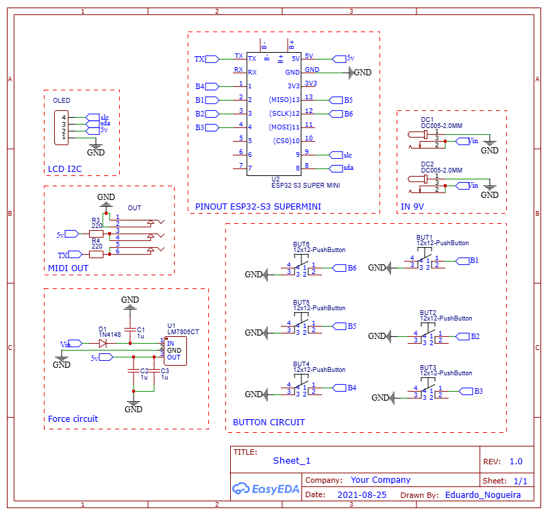
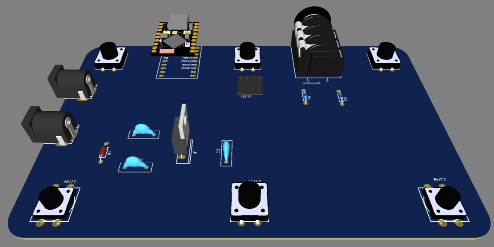
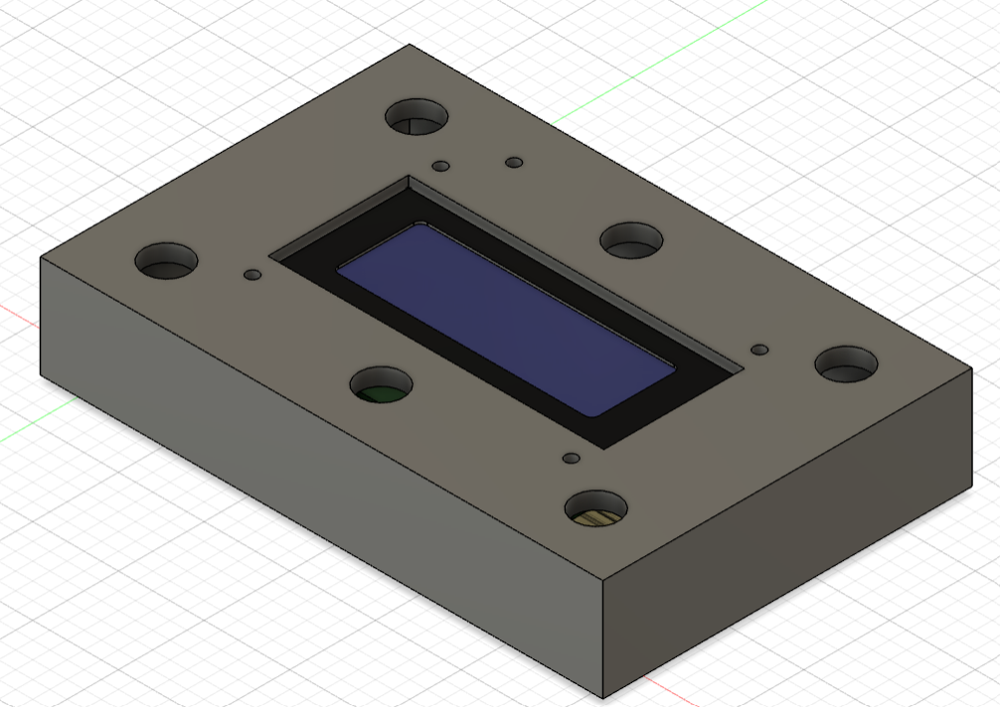

| Supported Targets | ESP32-S3 |
| ----------------- | -------- |

# _Tonex ONE_ 

## Goal 

The project aims to implement footswitches directly on the microcontroller and an LCD via I2C, in addition to providing a PCB for prototyping and the case in 3D printing. In the modifications of the original code there is the implementation of the 20x4 LCD display using I2C and 6 pedals were directly inserted, and some combined functions for triggering delay, compressor and modulation.

## 🙏 Acknowledgements 
- [Greg Smith's](https://github.com/Builty/TonexOneController) All system features. This project is completely based on Greg Smith's project.
- https://github.com/vit3k/tonex_controller for great work on reverse engineering the Tonex One USB protocol.

## Build
The project is ready to be built using the ESP32-S3 SUPER-MINI. To modify the platform, simply adjust the pinout in the folder.

## ESP32-S3

## Circuit Schematics

## 3d Circuit

In the link below we have the gerber for making the circuit board.

Gerber: 

## Case 3d

Below we have the files for printing on a 3D printer. It is important to worry about filling the walls so that there is good mechanical resistance.

## Device

